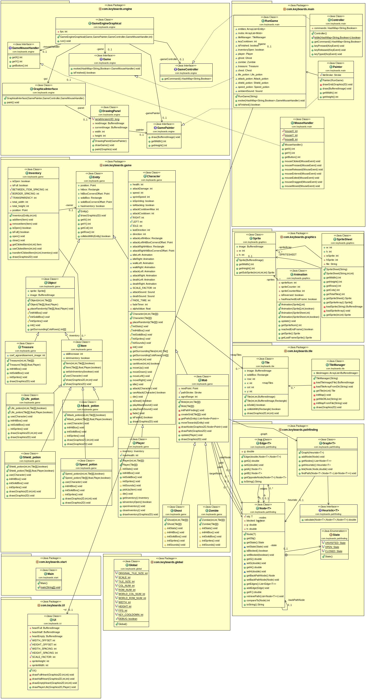

# Backlog 3: début

**Fonctionnalités pour le sprint 3 :**

- Fonctionnalité Pause
- Animation monstres
- Game Over
- Bruitages
- Map du niveau 2

**Qui fait quoi :**

- Robin : Fonctionnalité Pause + classe animation
- Elsa : Construction de la map du niveau 2
- Antoine : Animation monstres
- Audrey : Game Over
- Loric : Bruitages

## Diagramme de classes

