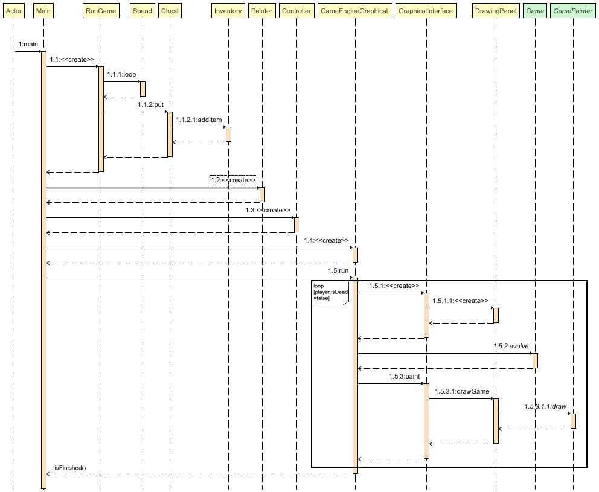
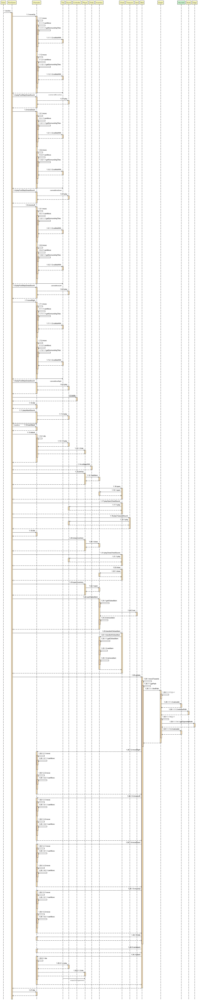

# Backlog 4 début

**Fonctionnalités pour le sprint 4 :**

- Caméra qui suit le joueur
- Changement de map une fois trésor trouvé
- Enlever collision fantôme
- Cases pièges et cases téléportations si obligatoire
- Faire test Junit

**Qui fait quoi :**

- Robin: Caméra
- Elsa : Changement de map
- Loric : test Junit base déplacement
- Audrey : test Junit dégats
- Antoine : Cases spécial

## Diagramme de classes

## Diagramme de séquence

**Fonctionalitée launch :**

**Fonctionalitée evolve :**

